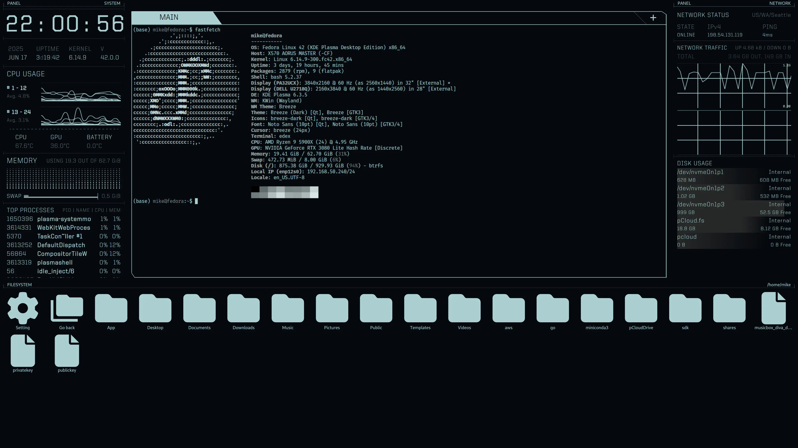

# eDex-UI

This is a rewrite of project [edex-ui](https://github.com/GitSquared/edex-ui) using [Tauri](https://github.com/tauri-apps/tauri).

The primary reason for rewriting stems from the original package being archived and exhibiting poor performance, characterized by excessively high CPU usage and high memory usage.
Furthermore, there is a need to enhance the displayed information with more practical and valuable content for daily usage.

Currently, this project only support macOS and Linux since I do not do development on Windows (PR Welcome.).

### Major Change

- No limit on number of terminals
- Show temperature on major hardware like CPU, GPU and Battery on laptop
- Remove keyboard as it is useless during daily usage
- Replace geolocation view with disks view

### Followup

> PR welcome on new features

- add Shortcuts to control terminal tabs
- More styling or functions on terminal
- Add webGL render support for terminal
- Add support for styles in the original packages

## Build

Since it use Tauri framework, make sure setup environment properly following [guide](https://tauri.app/v1/guides/getting-started/prerequisites).

### Development

```
npm run dev
```

### Production Build

```
npm run build
```

#### Debug Build

```
npm run build-debug
```

## Performance

### MacOS

On MacOS, it consumes around 1% Total CPU and less than 500Mb memory including webkit memory usage.

### Linux (Wayland)

Due to Tauri use `webkitgtk` on linux, it consumes around 5% Total CPU which majorly caused by poor performance of the dependency.

## Screenshots


[neofetch](https://github.com/dylanaraps/neofetch) on MacOS


[fastfetch](https://github.com/fastfetch-cli/fastfetch/) on Fedora
